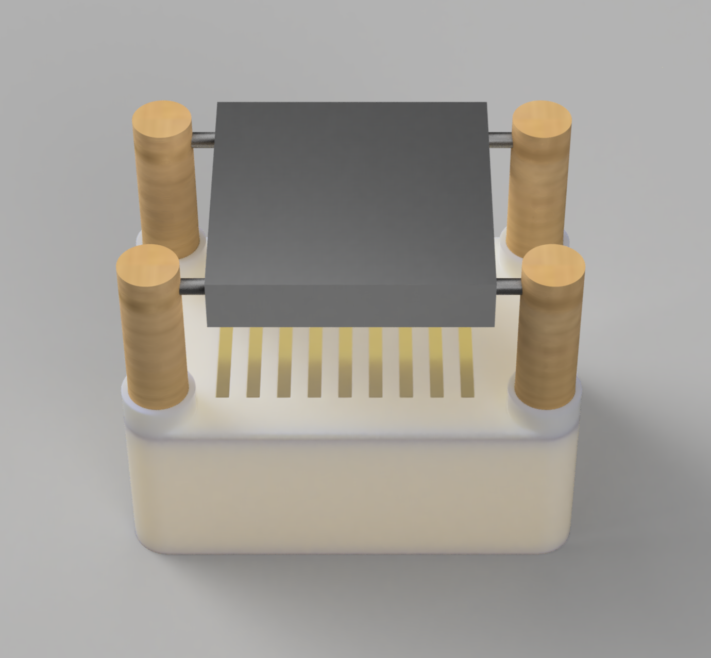
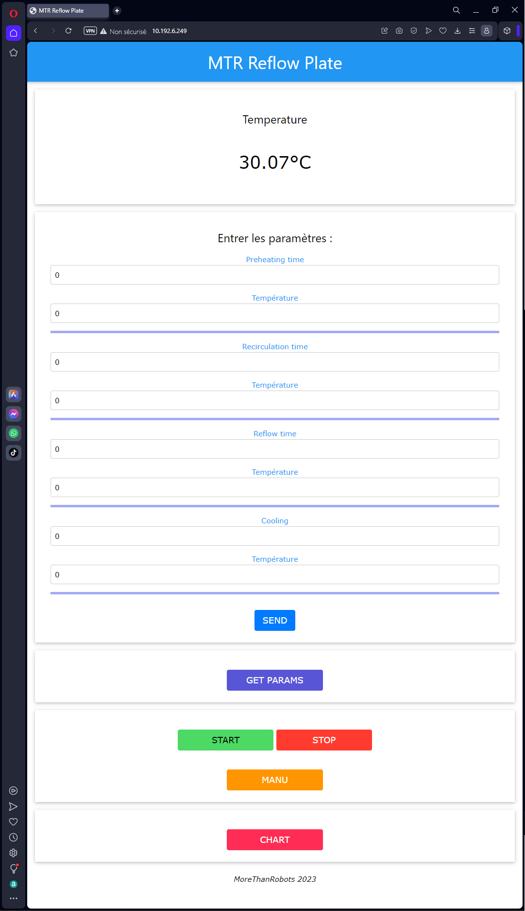
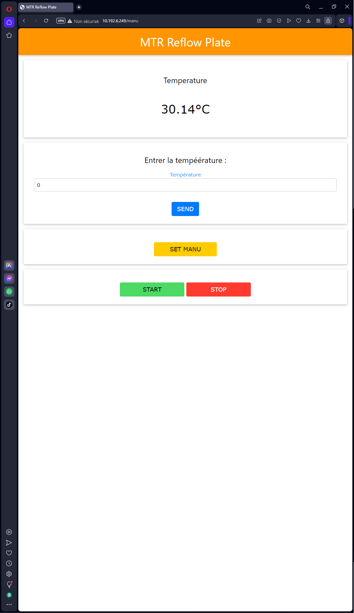
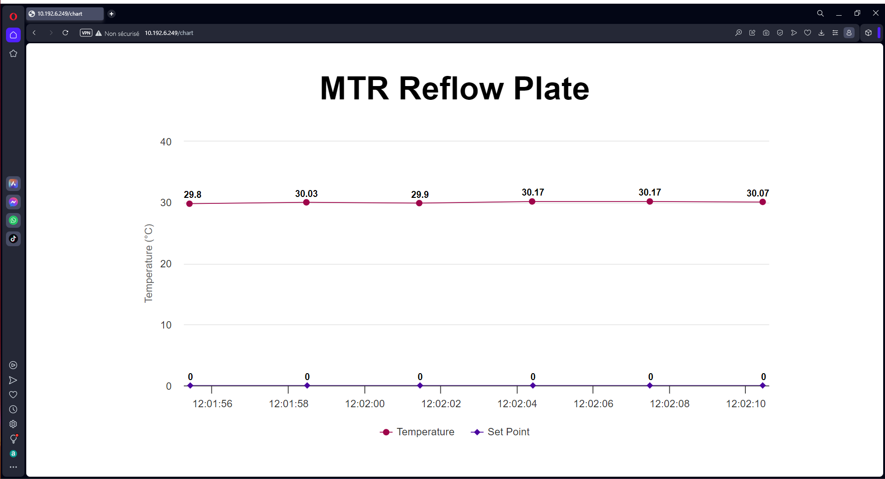

# MTR Reflow Plate

<p align="center">

&nbsp;

&nbsp;

&nbsp;
<a href="https://bmc.link/MoreThanRobots" target="_blank"></a>
</p>

## Description du projet
Le projet MTR Reflow Plate est un contrôleur de température pour une plaque de refusion. Il permet de réguler la température de la plaque et de suivre les différentes zones de température lors du processus de refusion.

<p align="center">

</p>

## Plateforme matériel
La plateforme matérielle utilisée est l'ESP32 DevKit V1, un microcontrôleur à base de WiFi et Bluetooth intégré. Elle est utilisée en combinaison avec un capteur de température PT100 K avec un MAX31865 et un corps chauffant.

<p align="center">

</p>

## Installation du firmware
Le code du firmware se trouve dans le répertoire "fireware".

### Prérequis
- La version du logiciel Arduino IDE utilisée doit être compatible avec l'ESP32.
- Les bibliothèques suivantes doivent être installées via le gestionnaire de bibliothèques d'Arduino :
  - Wire
  - SPI
  - SPIFFS
  - [ESPmDNS](https://github.com/espressif/arduino-esp32/tree/master/libraries)
  - [AutoPID](https://github.com/r-downing/AutoPID)
  - [Adafruit_MAX31865](https://github.com/adafruit/Adafruit_MAX31865)
  - [ESPAsyncWebServer](https://github.com/me-no-dev/ESPAsyncWebServer)
  - [AsyncElegantOTA](https://github.com/ayushsharma82/AsyncElegantOTA)
  - [ESPConnect](https://github.com/ayushsharma82/ESPConnect)
  - [ESPAsyncTCP](https://github.com/me-no-dev/ESPAsyncTCP)
  - [Adafruit_BusIO](https://github.com/adafruit/Adafruit_BusIO)
  
  *(`ESPAsyncTCP` et `Adafruit_BusIO` ne sont pas inclus dans le code source du firmware, mais sont nécessaire pour compiler le code. La bibliothèque `ESPmDNS` est incluse dans le package ESP32 pour Arduino IDE)*

### Configuration du matériel
1. Connectez le capteur de température MAX31865 à l'ESP32 comme suit :
   - CS du MAX31865 à la broche `5` 
   - MOSI du MAX31865 à la broche `23` 
   - MISO du MAX31865 à la broche `19` 
   - CLK du MAX31865 à la broche `18` 
2. Connectez le corps chauffant à la broche `4`
3. Connectez le bouton reset à la broche `15` (facultatif)
4. Connectez les leds d'état (facultatif) :
    - LED verte à la broche `12` (dernière etape du processus de refusion)
    - LED rouge à la broche `14` (temperature atteinte)
    - LED bleue à la broche `27` (processus de refusion en cours)
    - LED blanche à la broche `26` (processus de refusion en pause)
    - LED jaune à la broche `32` (mode manuel activé)

### Téléchargement et configuration du firmware
1. Téléchargez le code source du firmware depuis le répertoire "fireware".
2. Ouvrez le fichier "MTR_Reflow_Plate/fireware/src/main.cpp" dans l'IDE Arduino.
3. Modifiez les paramètres de température et de durée des différentes zones selon vos besoins.
4. Compilez et téléchargez le code sur l'ESP32.
4. Si vous souhaitez personnaliser le nom du réseau et le mot de passe WiFi, connectez vous au reseau WiFi "MTR_XXXX" et accédez au portail captif en entrant l'adresse `http://mtr-reflow-plate.local/` dans votre navigateur Web.

### Connexion WiFi avec Portail Captif et Mise à jour OTA

La plaque de refusion MTR utilise la bibliothèque ESPConnect.h pour gérer la connexion WiFi avec portail captif, simplifiant ainsi le processus de configuration du réseau. La bibliothèque AsyncElegantOTA.h permet quant à elle la mise à jour OTA du firmware de la plaque de refusion de manière pratique et sans fil. Ces fonctionnalités offrent une expérience utilisateur améliorée en facilitant la connexion à un réseau WiFi et en permettant la mise à jour du firmware en quelques étapes simples.

## Utilisation de l'interface utilisateur
Lorsque le firmware est correctement chargé sur l'ESP32, vous pouvez accéder à l'interface utilisateur depuis un navigateur Web en entrant l'adresse IP attribuée à l'ESP32.

L'interface utilisateur dispose de plusieurs fonctionnalités :
- **Temperature**: Affiche la valeur actuelle de la température.
- **SET Params**: Permet de définir les paramètres de température et de durée des différentes zones.
- **START**: Démarre le processus de refusion selon les paramètres définis.
- **STOP**: Arrête le processus de refusion.
- **MANU**: Permet de passer en mode de contrôle manuel de la température.
- **Chart**: Affiche un graphique des températures mesurées.

## Exemple de code pour l'utilisation de l'API REST
Il est possible de contrôler la refusion en utilisant l'API REST fournie par l'ESP32.

Voici quelques exemples d'utilisation de l'API REST :
- Récupérer la température actuelle :
  ```
  GET /readTemperature
  ```
- Récupérer la consigne de température actuelle :
  ```
  GET /readSetPoint
  ```
- Définir les paramètres de température et de durée des différentes zones :
  ```
  POST /params
  Content-Type: application/x-www-form-urlencoded
  
  temps_zone_preheating=100000&temperature_zone_preheating=80&temps_zone_recirculation=100000&temperature_zone_recirculation=120&temps_zone_reflow=10000&temperature_zone_reflow=183&temperature_zone_cooling=23
  ```
Pour plus d'informations sur l'utilisation de l'API REST, veuillez consulter le fichier [Firmware/MTR_Reflow_Plate/data/README.md](./Fimrware/MTR_Reflow_Plate/data/README.md).

## Documentation de l'interface web

### Introduction
L'interface web de la plaque de refusion MTR permet de visualiser la température actuelle, de contrôler le mode de fonctionnement (automatique ou manuel) et de configurer les paramètres de refusion. Cette documentation présente les pages principales de l'interface : index.html, manu.html et chart.html.

### index.html
La page index.html est la page d'accueil de l'interface web de la plaque de refusion MTR. Elle permet de visualiser la température actuelle, de configurer les paramètres de refusion et de contrôler le démarrage et l'arrêt du processus de refusion. La page comprend les sections suivantes :

- **Température actuelle** : Affiche la température actuelle de la plaque de refusion en degrés Celsius.
- **Configuration des paramètres** : Permet de définir les temps et les températures de chaque zone de refusion (préchauffage, recirculation, refusion et refroidissement).
- **Boutons de contrôle** : Permettent de démarrer ou d'arrêter le processus de refusion, ainsi que de passer en mode manuel.
- **Affichage des paramètres** : Affiche les paramètres de refusion actuels.

<p align="center">

</p>

### manu.html
La page manu.html permet de contrôler la plaque de refusion en mode manuel. Elle affiche la température actuelle et permet de définir une température manuelle. La page comprend les sections suivantes :

- **Température actuelle** : Affiche la température actuelle de la plaque de refusion en degrés Celsius.
- **Définition de la température manuelle** : Permet de définir une température manuelle pour la plaque de refusion.
- **Boutons de contrôle** : Permettent de démarrer ou d'arrêter le chauffage ou le refroidissement de la plaque de refusion.

<p align="center">

</p>

### chart.html
La page chart.html affiche un graphique en temps réel de la température de la plaque de refusion. Le graphique est mis à jour automatiquement toutes les quelques secondes et affiche la température actuelle ainsi que la température de consigne. La page comprend les sections suivantes :

- **Graphique de température** : Affiche le graphique en temps réel de la température de la plaque de refusion et de la température de consigne.

<p align="center">

</p>

### Conclusion
L'interface web de la plaque de refusion MTR offre une visualisation claire de la température actuelle de la plaque, ainsi que des fonctionnalités de contrôle et de configuration pour le processus de refusion. Les pages index.html, manu.html et chart.html fournissent une interface conviviale pour interagir avec la plaque de refusion et surveiller le processus de refusion en temps réel.

## Auteur
Ce projet a été développé par Ciciliano Altmann pour MTR (MoreThanRobots).

## Licence
Ce projet est distribué sous licence MIT. Veuillez consulter le fichier "LICENSE" pour plus d'informations.
